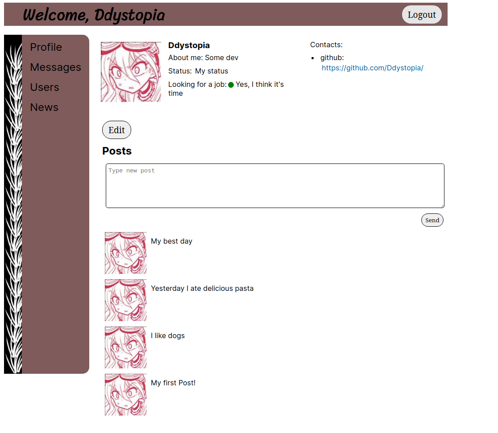

# Social Network

## Features

This social network has the following abilities:

- User login and logout
- Viewing profiles of other users
- Profile creation with the ability to set a photo, add a bio, set a status,
  indicate job-seeking status, and set constants
- Chat functionality that allows users to create new chats, send messages,
  receive messages, remove messages, and restore messages
- Message status checks, such as viewing if a message has been read
- Newsfeed

## About the Project

This project was originally written as a learning exercise three years ago.
Recently, I've revisited the project, rewriting it from JavaScript with
create-react-app to TypeScript with create-next-app. I've also been improving
the codebase for better maintainability, cleaner code structure, improved state
management, and the addition of server-side rendering capabilities.

The project is based on an API provided in a front-end course, and it functions
as a simple social network front-end. I've learned a lot about Redux, React,
Next.js, and testing during the development process. The project currently
consists of over 4000 lines of code, spanning CSS, JavaScript, TypeScript, and
TSX files.

## Key Features

### Redux and State Management

The project uses Redux for state management. The Redux state is structured with
a focus on scalability and ease of use. For example, I've refactored the way
user profiles are stored in the Redux store. Initially, there were separate
storage sections for the user's own profile and the profile of another user they
may be viewing. This setup was hard to work with and has been restructured so
that there is now a map where the key is an ID and the value is a profile,
significantly improving the clarity and ease of use of the Redux state.

### React and Next.js

The project leverages the power of React's component-based structure, allowing
for highly reusable code. There's extensive use of both class and functional
components, as well as React hooks like useEffect used 35 times and useState .
The project also explores advanced features like React's Suspence and routing in
Next.js. This combination enables more efficient code and aids in understanding
how different pieces fit together in a React/Next.js application.

<!--
### Persistence

A key challenge was to persist the state between reloads for a smoother user
experience. This challenge was addressed by extensive research, debugging,
experimentation, and leveraging the strengths of Redux and React.
-->

## Testing

Unit testing is performed on key functions to ensure that they work as expected.
While the tests may be simple, they form a crucial part of ensuring that each
function performs its role effectively. However, the testing part is still a
work in progress and will be further extended. <!-- TODO -->

## Contributions

As this project was primarily for my learning, I don't currently have any plans
for contributions. However, I'm always open to feedback and suggestions.

## Contact

For any queries, suggestions, or potential collaboration, you can reach me
through my GitHub profile, where my contact information is available. Please
also check out the repository for this project.

## Running the Project

You can set up this project locally by cloning the repo and running yarn dev.
Ensure that you have all the dependencies required to develop with Next.js
installed on your local machine.

Please note that this README and the project itself are under active
development. Any updates or changes will be reflected here.

## Final Thoughts

This project has been a massive learning journey for me. It has allowed me to
explore and understand the depths of React, Redux, Next.js, TypeScript, and
more. While it was challenging, the insights gained from this project are
invaluable. I hope to apply these lessons in my future projects to create more
efficient and effective codebases.
